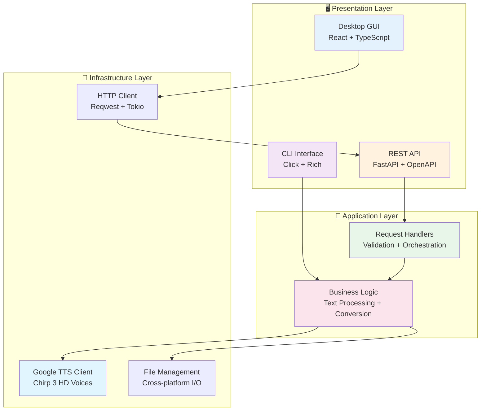

# 🥝 KIWI TTS

<div align="center">


### 🎯 **Professional Multi-Interface Text-to-Speech Application**
*Transform text into beautiful speech with Google's premium Chirp 3 HD voices*

[](https://github.com/Abdulrahman-Elsmmany/kiwi)
[](https://www.python.org/)
[](LICENSE)
[](https://github.com/Abdulrahman-Elsmmany)


</div>

---

## 🖼️ Experience KIWI TTS

<div align="center">
  
### ✨ **Beautiful Desktop Interface for Premium Text-to-Speech**


*🎤 Professional Text-to-Speech with 30+ Premium Voices and Intuitive Interface*

</div>

### 🎯 **Launch Applications**

```bash
# 🖥️ Start the beautiful desktop experience
cd gui && npm run tauri dev

# ⚡ Use the powerful CLI
uv run kiwi document.md --voice en-US-Chirp3-HD-Kore

# 🌐 Launch the REST API server
uv run kiwi server --reload
```

**Multi-Interface Features:**
- 🖥️ **Modern Desktop GUI** - Beautiful Tauri app with drag-and-drop support
- 🎤 **30+ Premium Voices** - Google Chirp 3 HD voices across 28 languages
- 📁 **Smart File Management** - Custom output locations with OS integration
- ⚡ **Lightning Fast** - Optimized HTTP architecture for instant response
- 📊 **Real-time Progress** - Live conversion updates and audio preview
- 🔄 **Format Flexibility** - MP3 (24kHz) and WAV output formats
- 🎯 **Developer Friendly** - Full REST API with OpenAPI documentation

---

## 🎯 Why KIWI TTS?

### ✨ **Enterprise-Grade Architecture**
- 🏗️ **Multi-tier Architecture** - Clean separation of concerns across layers
- 🔒 **Type Safety Everywhere** - TypeScript, Python hints, Rust memory safety
- ⚡ **Performance Optimized** - HTTP keep-alive, connection pooling, lazy loading
- 🌍 **Cross-Platform Native** - Windows, macOS, Linux with native performance

### 🚀 **Built for Professionals**
- 📝 **Advanced Text Processing** - Markdown support with front matter parsing
- 🎨 **Beautiful UI/UX** - Modern React + shadcn/ui components
- 🔧 **Developer Experience** - Hot reload, comprehensive testing, clean APIs
- 📊 **Production Ready** - Error handling, logging, monitoring capabilities

---

## 🚀 Quick Start Guide

### 📦 Installation

```bash
# Clone the repository
git clone https://github.com/Abdulrahman-Elsmmany/kiwi.git
cd kiwi

# Install Python dependencies with UV (ultrafast)
uv sync

# Install GUI dependencies
cd gui && npm install
```

### ⚙️ Google Cloud Configuration

```bash
# 🔑 Authenticate with Google Cloud
gcloud auth login
gcloud auth application-default login

# 🎤 Enable Text-to-Speech API
gcloud services enable texttospeech.googleapis.com

# 🎯 Set your project
gcloud config set project YOUR_PROJECT_ID
```

### 🎯 Get Started in 30 Seconds

```bash
# 🖥️ Launch the desktop app (recommended)
# Terminal 1: Start API server
uv run kiwi server

# Terminal 2: Launch GUI
cd gui && npm run tauri dev

# ⚡ Or use CLI directly
uv run kiwi document.md --voice en-US-Chirp3-HD-Kore
```

---

## ✨ Multi-Interface Capabilities

<table>
<tr>
<td>

### 🖥️ **Desktop Application**
- **Tauri 2.0** native performance
- **Drag & drop** file interface
- **Real-time progress** tracking
- **Audio preview** with controls
- **Custom output** directory selection

</td>
<td>

### ⚡ **Command Line Interface**
- **Simple commands** for quick conversion
- **Batch processing** support
- **Voice listing** and filtering
- **Multiple formats** (MP3/WAV)
- **Pipeline friendly** design

</td>
</tr>
<tr>
<td>

### 🌐 **REST API Server**
- **FastAPI** with async support
- **OpenAPI/Swagger** documentation
- **File upload** endpoints
- **Streaming responses** available
- **CORS enabled** for web apps

</td>
<td>

### 🎤 **Premium Voice Quality**
- **30+ Chirp 3 HD** voices
- **28 languages** supported
- **Natural intonation** and emotion
- **24kHz MP3** or uncompressed WAV
- **Smart text** preprocessing

</td>
</tr>
</table>

---

## 🎯 Usage Examples

### 🖥️ **Desktop GUI Features**

```typescript
// Beautiful component architecture
<FileUpload onFileSelect={handleFile} />
<VoiceSettings language="en-US" voice={selectedVoice} />
<ConversionProgress status={conversionStatus} />
<AudioResult audioUrl={resultUrl} />
```

### ⚡ **CLI Commands**

```bash
# 📄 Convert a markdown file
uv run kiwi README.md

# 🎤 Use a specific voice
uv run kiwi document.txt --voice en-US-Chirp3-HD-Zephyr

# 📁 Custom output location
uv run kiwi file.md --output ~/Desktop/speech.mp3

# 📋 List all available voices
uv run kiwi voices --language en-US

# 🔊 Generate WAV format
uv run kiwi text.txt --format wav
```

### 🌐 **API Endpoints**

```bash
# 📤 Upload and convert file
curl -X POST "http://localhost:8000/api/convert" \
  -F "file=@document.md" \
  -F "voice=en-US-Chirp3-HD-Kore" \
  -F "format=MP3"

# 📋 Get available voices
curl "http://localhost:8000/api/voices?language=en-US"

# 📊 Check API health
curl "http://localhost:8000/health"
```

---

## 🏗️ Architecture & Design Patterns

<div align="center">

### 🎯 **Clean Architecture Implementation**



</div>

---

## 🎤 Premium Voice Catalog

<div align="center">

### 🌟 **Chirp 3 HD Voices - Crystal Clear Quality**

| Language | Voices Available | Popular Choices |
|----------|------------------|-----------------|
| **🇺🇸 English (US)** | 8 voices | Kore (Warm), Zephyr (Dynamic), Achernar (News) |
| **🇬🇧 English (UK)** | 4 voices | Hera (Refined), Oberon (Classic) |
| **🇫🇷 French** | 3 voices | Sylvie (Elegant), Pierre (Professional) |
| **🇩🇪 German** | 3 voices | Klaus (Authoritative), Emma (Friendly) |
| **🇪🇸 Spanish** | 4 voices | Carmen (Expressive), Miguel (Clear) |
| **🇯🇵 Japanese** | 2 voices | Yuki (Gentle), Haruto (Professional) |
| **🇰🇷 Korean** | 2 voices | Min-ji (Warm), Jun-ho (Clear) |
| **And 21 more languages!** | 30+ total | Run `uv run kiwi voices` for full list |

</div>

---

## 🛠️ Advanced Development

### 📁 **Professional Project Structure**

```
kiwi/
├── 🐍 src/kiwi/              # Python Backend
│   ├── __init__.py           # Package initialization
│   ├── main.py               # CLI with Click framework
│   ├── api.py                # FastAPI REST server
│   ├── tts.py                # Google Cloud TTS client
│   ├── parsers.py            # Text/Markdown processing
│   └── utils.py              # Shared utilities
│
├── 🖥️ gui/                   # Tauri Desktop App
│   ├── src/                  # React Frontend
│   │   ├── App.tsx           # Main application
│   │   ├── components/       # UI Components
│   │   │   ├── ui/           # shadcn/ui components
│   │   │   └── *.tsx         # Feature components
│   │   └── lib/              # Utilities & hooks
│   │
│   ├── src-tauri/            # Rust Backend
│   │   ├── src/
│   │   │   ├── lib.rs        # Tauri commands
│   │   │   └── main.rs       # Application entry
│   │   └── Cargo.toml        # Rust dependencies
│   │
│   └── package.json          # Node dependencies
│
├── 🧪 tests/                 # Test Suite
│   ├── unit/                 # Unit tests
│   ├── integration/          # Integration tests
│   └── fixtures/             # Test data
│
├── 📚 docs/                  # Documentation
├── 🔧 pyproject.toml         # Python config
└── 📋 PLANNING.md            # Architecture docs
```

### 🚀 **Performance & Best Practices**

- **Async Everything** - Non-blocking I/O throughout the stack
- **Connection Pooling** - Reuse HTTP connections for speed
- **Lazy Loading** - Load resources only when needed
- **Error Boundaries** - Graceful error handling at every level
- **Type Safety** - Full typing in Python, TypeScript, and Rust
- **Memory Efficiency** - Stream large files, minimize allocations
- **Cross-platform** - Native performance on all platforms

---

## 🔧 Development Commands

### 🧪 **Testing & Quality**

```bash
# 🐍 Python Testing
uv run pytest                        # Run all tests
uv run pytest --cov=kiwi            # With coverage
uv run ruff check src/ tests/       # Lint code
uv run mypy src/                    # Type checking

# 🖥️ Frontend Testing
cd gui && npm run test              # Run tests
cd gui && npm run lint              # ESLint
cd gui && npm run type-check        # TypeScript

# 🦀 Rust Testing
cd gui/src-tauri && cargo test      # Run tests
cd gui/src-tauri && cargo clippy    # Lint
```

### 🏗️ **Building & Distribution**

```bash
# 📦 Build Python package
uv build

# 🖥️ Build desktop app
cd gui && npm run tauri build

# 🐳 Build Docker image
docker build -t kiwi-tts .

# 🚀 Production deployment
uv run kiwi server --host 0.0.0.0 --port 8000
```

---

## 🗺️ Roadmap & Future Features

### 🎯 **Version 2.0** (Q2 2025)
- ✅ Batch file processing with queue management
- ✅ SSML support for advanced speech control
- ✅ Audio post-processing (speed, pitch control)
- ✅ WebSocket support for real-time streaming

### 🎯 **Version 3.0** (Q4 2025)
- 📋 Web application version
- 📋 Mobile apps (iOS/Android)
- 📋 Voice cloning capabilities
- 📋 Multi-cloud support (AWS Polly, Azure Speech)

### 🎯 **Version 4.0** (2026)
- 📋 AI-powered voice selection
- 📋 Collaborative workspaces
- 📋 Plugin ecosystem
- 📋 Analytics dashboard

---

## 🏆 Skills Demonstrated

This project showcases expertise in:

### **Frontend Excellence**
- ⚛️ Modern React patterns with hooks and context
- 📘 TypeScript for bulletproof type safety
- 🎨 Beautiful UI with shadcn/ui components
- 📱 Responsive design with Tailwind CSS
- ⚡ Performance optimization techniques

### **Backend Mastery**
- 🐍 Async Python with FastAPI
- 🔒 Secure API design with validation
- 📊 RESTful architecture patterns
- 🧪 Comprehensive testing strategies
- 📈 Performance monitoring and optimization

### **Desktop Development**
- 🦀 Rust for system-level performance
- 🖥️ Cross-platform native applications
- 🔌 IPC communication patterns
- 📁 Native file system integration
- 🎯 OS-specific optimizations

### **DevOps & Tooling**
- 🐳 Containerization with Docker
- 🔧 Modern build tools (uv, Vite, Cargo)
- 🧪 CI/CD pipeline design
- 📊 Monitoring and observability
- 🚀 Production deployment strategies

### **Cloud Integration**
- ☁️ Google Cloud Platform expertise
- 🔐 Secure authentication flows
- 📈 API rate limiting and quotas
- 🔄 Retry strategies and resilience
- 💰 Cost optimization techniques

---

## 🤝 Contributing

We welcome contributions! See our [Contributing Guide](CONTRIBUTING.md) for details.

```bash
# 1. Fork the repository
# 2. Create your feature branch
git checkout -b feature/amazing-feature

# 3. Make your changes and test
uv run pytest

# 4. Commit with conventional commits
git commit -m "feat: add amazing feature"

# 5. Push and create a Pull Request
git push origin feature/amazing-feature
```

---

## 📞 Support & Community

<div align="center">

### 🌟 **Get Help & Connect**

[](https://github.com/Abdulrahman-Elsmmany/kiwi/issues)
[](https://github.com/Abdulrahman-Elsmmany/kiwi/discussions)
[](https://github.com/Abdulrahman-Elsmmany/kiwi/wiki)

### 🎤 **Share Your Creations**
Show us what you've created with KIWI TTS!
[](https://github.com/Abdulrahman-Elsmmany/kiwi/discussions/categories/showcase)

</div>

---

## 📄 License & Attribution

This project is licensed under the **MIT License** - see the [LICENSE](LICENSE) file for details.

**Acknowledgments:**
- 🎤 **Google Cloud** for premium Chirp 3 HD voices
- 🖥️ **Tauri Team** for the amazing desktop framework
- ⚡ **FastAPI** for the modern Python web framework
- 🎨 **shadcn/ui** for beautiful React components
- 🚀 **uv** for ultrafast Python package management

---

<div align="center">

### 🥝 **KIWI TTS**

*Transform Text into Beautiful Speech*

**Created with ❤️ by [Abdulrahman Elsmmany](https://github.com/Abdulrahman-Elsmmany)**

[](https://github.com/Abdulrahman-Elsmmany)

[](https://linkedin.com/in/abdulrahman-elsmmany)

---

**⭐ Star this repository if KIWI TTS helps you create amazing audio content!**

*Let's transform text into speech together* 🚀

### 🎤📝🎵 *Premium Voices • Beautiful Interface • Professional Quality*

</div>